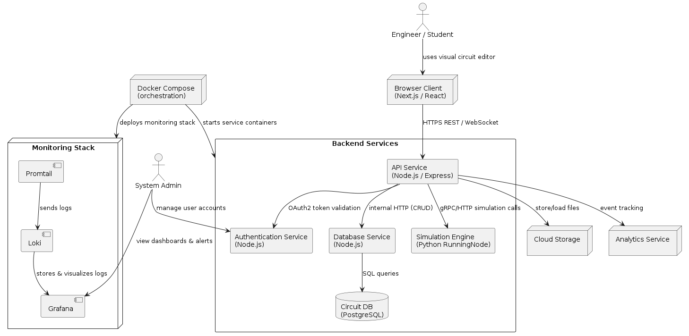

<p style="text-align: center;">
  <br>
  <strong style="font-size:2em">Visual Circuit Designer</strong><br>
  <em>Visual Circuit Designer</em> – is a web-based tool for designing, simulating, and managing digital logic circuits in the browser. It features a drag-and-drop interface, real-time manipulation, and cloud saving, making it ideal for engineers, students, and developers.<br><br>
  <a href="http://85.198.81.168/" style="font-size:1.5em; text-decoration:none;">
    📡 Link to our product 📡
  </a><br>
  <a href="https://www.dropbox.com/scl/fi/kcxxc5cz42887zjii5ldx/1751819213849975.mov?rlkey=f76pp6tpqy4gins6vws7u9juk&st=sq0ln26u&dl=0"
     style="font-size:1.5em; text-decoration:none;">
    📹 Video demo v2 📹
  </a>
</p>


---

# <div align="center">💻 Usage 💻</div>

## <div align="center">▪️ <em>Project goals and description</em> ▪️</div>

### <div align="center"><strong>Project Goal</strong></div>
<div align="center">To create a web-based, no-installation-required platform for designing, simulating, and managing digital logic circuits with an intuitive drag-and-drop interface.</div>

### <div align="center"><strong>Key Features</strong></div>
- Visual Circuit Design – Drag-and-drop logic gates (AND, OR, INPUT, OUTPUT, etc.)
- Real-Time Editing – Rotate, flip, duplicate, and connect components dynamically
- Cloud Saving – Save/load circuits via backend API (preserves structure, inputs, layout)
- User-Friendly UX – Grid snapping, zoom/pan, multi-select (Ctrl + drag), context menus
- No Local Software Needed – Fully browser-based

### <div align="center"><strong>User Flow</strong></div>
- Auth → Register/login to access saved projects
- Dashboard → View, load, delete, or create new circuits
- Workspace → Build circuits visually, save/load from cloud

<strong>Ideal for:</strong> Engineers, students, and developers learning or prototyping digital logic.</div>

## <div align="center">▪️ <em>Project Context Diagram</em> ▪️</div>
Below you can see a high-level context diagram of **Visual Circuit Designer**, showing all key stakeholders, 
external systems and data flows.

<figure style="margin: 0 auto; text-align: center;">
  
  <figcaption> Project Context Diagram</figcaption>
</figure>

### Legend

#### Stakeholders
- **Engineer / Student**: designs, simulates and saves circuits via the browser UI
- **System Admin**: manages user accounts and monitors system health

#### External Systems & Services
- **Browser Client (Next.js / React)**: front-end UI communicating over REST & WebSocket
- **Docker Compose**: orchestrates all backend & monitoring containers
- **API Service (Node.js / Express)**: central gateway for business logic
- **Authentication Service**: issues & validates OAuth2 tokens
- **Database Service**: CRUD interface to PostgreSQL
- **Simulation Engine (Python)**: executes logic simulations
- **Circuit DB (PostgreSQL)**: stores project schemas & metadata
- **Cloud Storage (S3-compatible)**: holds raw project files & exports
- **Analytics Service**: collects usage events (e.g. Google Analytics)
- **Monitoring Stack**: Promtail → Loki → Grafana for logging & dashboards

#### Data Flows
1. **User → Browser**: UI interaction
2. **Browser → API**: REST calls / WebSocket messages
3. **API → Auth, DB, Sim, S3, Analytics**: token validation, data persistence, simulation runs, file storage, telemetry
4. **Compose → Services & Monitoring**: container startup
5. **Promtail → Loki → Grafana**: log pipeline; Admin views dashboards

## <div align="center">▪️ <em>Feature Roadmap</em> ▪️ </div>

<div style="display: table; margin: 0 auto;">

| Stage                                             | Status         | Priority |
|---------------------------------------------------|----------------|----------|
| **MVP v0**                                        | delivered      | Must     |
| **MVP v1**                                        | delivered      |          |
| Connect Authentication of Users with back-end     | done           | Must     |
| Dashboard page without functionality              | done           | Should   |
| Pop-up interactive window with some settings      | done           | Should   |
| **MVP v2**                                        | delivered      |          |
| Save schematic to user account                    | done           | Must     |
| Implement logic of components                     | done           | Must     |
| Implement simulation of program                   | done           | Must     |
| Dashboard functionality (create/search projects)  | done           | Must     |
| Projects connect to user account                  | done           | Must     |
| **MVP v3**                                        | in development |          |
| Bugs fixing                                       | in process     | Should   |
| Implement simulation for more than one output     | in process     | Should   |
| New I/Os                                          | in process     | Should   |

</div>


#### Priority Definitions

| Priority | Description                                                    |
|----------|----------------------------------------------------------------|
| Must     | Critical features without which the release cannot take place       |
| Should   | Desirable features that are important to enable when possible     |
|          | Optional features or those that are carried over to future versions  |

## <div align="center">▪️ <em>Usage Instructions / Short User Guide<em> ▪️ </div>

<div style="width: fit-content; margin: 0 auto; border: 1px solid #ccc; padding: 10px; border-radius: 5px;">

### **To launch the MVP, open the deployed app at:**
- **URL:** `http://85.198.81.168/`
- **Note:** You can use any data on the registration page — first sign up, then sign in with the same credentials.

</div>


---

## 1. Accessing the Application
1. Open your browser and go to: http://85.198.81.168/
2. Wait for the page to fully load.

---

## 2. Registering a New User
> **Important:** First create an account via **Sign up**, then log in via **Sign in** using the same credentials.

1. Click **Sign up**.
2. Fill out the registration form fields:
- **Username**
- **Email**
- **Password**
- **Confirm Password**
3. For the MVP you can use any dummy data:
- A fake email (e.g., `test@example.com`)
- A simple password (e.g., `123456`)
4. Click **Register** / **Sign up**.
5. You should see a “Registration successful” message.

---

## 3. Logging In
1. Go to **Sign in**.
2. Enter the same credentials you used to register:
- **Username** / **Email**
- **Password**
3. Click **Log in** / **Sign in**.
4. You will be redirected to the **Dashboard**.

---

## 4. Main Navigation
After logging in, you’ll see these sections:

| Section       | Description                                                      |
|---------------|------------------------------------------------------------------|
| **Dashboard** | Overview of stats and quick links                                |
| **Data**      | List of your items with **Create**, **Read**, **Update**, **Delete** actions |
| **Settings**  | Notifications, privacy options, theme settings                   |

---

## 5. Example: Creating a New Record
1. Navigate to the **Data** section.
2. Click **Create New**.
3. Fill in the form fields (title, description, date, status).
4. Click **Save**.
5. Your new record will appear in the list with edit and delete icons.

---

## 6. Logging Out
1. In the top-right corner, click your **Username** (or profile icon).
2. Select **Logout**.
3. You will be redirected back to the sign-in page.

---

## 7. Tips & Recommendations
- If you encounter login errors, double-check that you’re entering the **exact** credentials you registered with.
- Server errors can be inspected in your browser console (F12 → Console).
- Use your browser’s incognito/private mode to clear sessions for testing.
- MVP validation is minimal—feel free to use any test data.

---

## <div align="center">▪️ <em> Project Installation & Deployment instructions </em> ▪️</div>

<div style="width: fit-content; margin: 0 auto; border: 1px solid #ccc; padding: 10px; border-radius: 5px;">

<div align="center">
If you wish to run the project locally:
</div>

</div>


1. **Clone the repository:**
    ```bash
    git clone https://gitlab.pg.innopolis.university/team-45/visual-circuit-designer.git
    ```
2. **Navigate to the project directory:**
    ```bash
    cd project
    ```
3. **Install dependencies:**  
   Ensure you have [Node.js](https://nodejs.org/) (v18+) and [npm](https://www.npmjs.com/) installed.
    ```bash
    npm install
    ```
4. **Create a `.env` file** (if required):  
   Copy the example file and edit environment variables as needed.
    ```bash
    cp .env.example .env
    ```
   Edit the `.env` file to set API endpoints, database URLs, etc.

5. **Start the app:**
    ```bash
    npm run dev
    ```
   The app will be available at [http://localhost:3000](http://localhost:3000)

### <div align="center">▪️ Troubleshooting ▪️</div>

- If you see errors on startup, ensure all environment variables are set correctly in the `.env` file.
- If port 3000 is busy, set a different port in your `.env` file (e.g., `PORT=4000`).
- Make sure you have network access to all required backend services.

---

<div align="center">
  <font size="5">
  <strong> 📢 What's new in MVP v2 📢 </strong>
  </font>
</div>
<div align="center">

- Compilation error handling
- Improved drag-and-drop UI
- Complete API logic for saving and loading circuit data
- Deploy project to production server with CI/CD
- Implement saving and loading of blocks
- Load Previously Saved Designs
- Save Schematics to User Account
</div>

<p align="center">
  <strong style="font-size:2.5em;">Hyperlinks to the Documentation</strong>
</p>

<ul style="list-style:none; padding:0; text-align:center;">
<li style="font-size:1.5em; margin:0.5em 0;">
    <a href="docs/architecture/Architecture.md" style="text-decoration:none;">Architecture</a>
  </li>
  <li style="font-size:1.5em; margin:0.5em 0;">
    <a href="docs/development/CONTRIBUTING.md" style="text-decoration:none;">Development</a>
  </li>
  <li style="font-size:1.5em; margin:0.5em 0;">
    <a href="./docs/quality-attributes/quality-attribute-scenarios.md" style="text-decoration:none;">
      Quality Characteristics &amp; Attribute Scenarios
    </a>
  </li>
  <li style="font-size:1.5em; margin:0.5em 0;">
    <a href="./docs/quality-assurance/automated-tests.md" style="text-decoration:none;">Quality Assurance Automated tests</a>
  </li>
   <li style="font-size:1.5em; margin:0.5em 0;">
    <a href="./docs/quality-assurance/user-acceptance-tests.md" style="text-decoration:none;">Quality Assurance User tests</a>
  </li>
  <li style="font-size:1.5em; margin:0.5em 0;">
    <a href="./docs/automation/continuous-delivery.md" style="text-decoration:none;">
      Сontinuous delivery
    </a>
  </li>
<li style="font-size:1.5em; margin:0.5em 0;">
    <a href="./docs/automation/continuous-integration.md" style="text-decoration:none;">
      Сontinuous integration
    </a>
  </li>
</ul>


