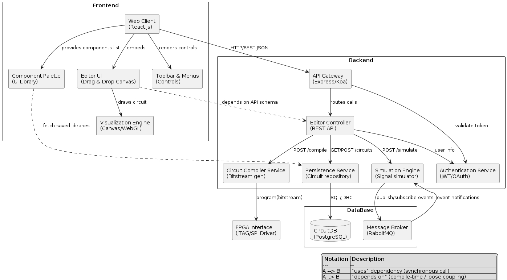
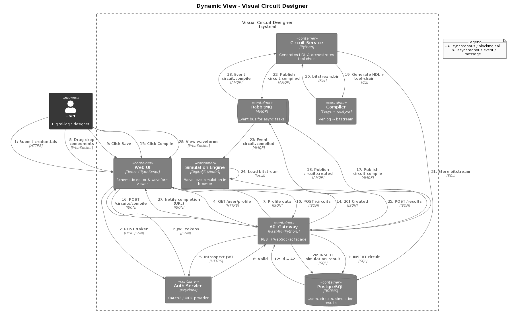
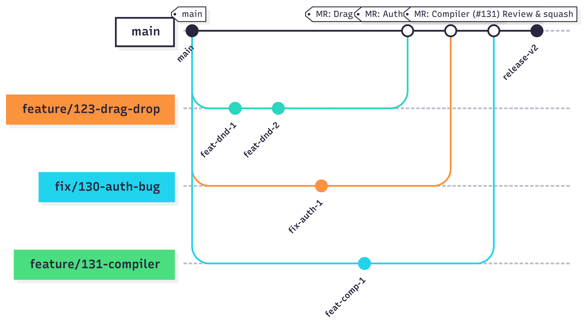

# Visual Circuit Designer

**_Visual Circuit Designer_** is a comprehensive web-based platform that empowers users to design, simulate, and manage digital logic circuits entirely within the browser—without the need for any local installations or specialized software.

The application offers an intuitive drag-and-drop interface, allowing engineers, students, and developers to visually assemble circuits from fundamental logic components such as gates, inputs, and outputs. Every element can be manipulated in real time: positioned, connected, rotated, flipped, or duplicated with ease.

Visual feedback and dynamic connections provide clarity and accuracy in design, while grid snapping, zooming, and multi-element selection streamline the user experience. Circuits can be saved to and retrieved from a backend API, maintaining their structure, logic, input values, and spatial arrangement.

---

# 🚀 Usage
### 🏠 Welcome Page
- The user is greeted with an introduction to the Visual Circuit Designer.

- From here, they can either log in or register to access their dashboard.

### 🔐 Registration & Authentication
- New users can create an account via the Registration page.

- Existing users can log in to access saved projects and create new circuits.

### 📊 Dashboard
- After logging in, the user is redirected to the Dashboard.

- Here, they can:
   - View a list of previously saved circuits
   - Load a circuit for editing
   - Delete a saved circuit
   - Create a new blank project

### 🧩 Workspace
- The visual editor allows users to:

- Drag and drop logic elements (INPUT, OUTPUT, AND, OR, etc.)

- Snap elements to a grid

- Connect ports via drag-to-connect behavior

- Use context menus (right-click) for actions like rotate, flip, duplicate, cut

- Save the current circuit (structure, inputs, coordinates) to the backend

- Load a circuit from API by ID (with full state restoration)

- Zoom, pan, and select multiple elements using Ctrl + drag

## What's new in MVP v2
- Compilation error handling
- Improved drag-and-drop UI
- Complete API logic for saving and loading circuit data
- Deploy project to production server with CI/CD
- Implement saving and loading of blocks
- Load Previously Saved Designs
- Save Schematics to User Account

📹 [Video demo v2](https://www.dropbox.com/scl/fi/kcxxc5cz42887zjii5ldx/1751819213849975.mov?rlkey=f76pp6tpqy4gins6vws7u9juk&st=sq0ln26u&dl=0)

📘 [Product Roadmap](https://docs.google.com/spreadsheets/d/1SGbc4nW3ZNP6p4rJFL7kns3ftsbBbcRCNFcaKKOpOF8/edit?gid=725595302#gid=725595302)

🤖 [Access instruction](./frontend/docs/quality-attribute-scenarios.md)

---

## 🧱 Architecture

The architecture of Visual Circuit Designer is structured into three complementary views: static, dynamic, and deployment. Each view captures a different perspective of the system to ensure maintainability, scalability, and clarity for both developers and stakeholders.

---

### 📦 Static View

This view describes the main frontend and backend components of the system and their interactions.

- 🔗 

**Frontend:**
- Built with **React.js**
- Includes:
  - `Component Palette` – Library of logic components
  - `Editor UI` – Drag & drop schematic canvas
  - `Toolbar & Menus` – Control tools
  - `Visualization Engine` – Canvas/WebGL for drawing & waveforms

**Backend:**
- Consists of multiple services:
  - `API Gateway` (Express/Koa) – Entry point for REST & WebSocket
  - `Editor Controller` – REST API logic
  - `Circuit Compiler Service` – Converts circuit to bitstream
  - `Persistence Service` – Manages circuit data in PostgreSQL
  - `Simulation Engine` – Signal-level logic simulator
  - `Authentication Service` – OIDC-based access control
  - `Message Broker (RabbitMQ)` – Handles asynchronous jobs

> 💡 This architecture supports **loose coupling** between frontend/backend and encourages **separation of concerns**, improving testability and modularity.

---

### 🔄 Dynamic View

This view shows a runtime scenario of how a user creates, compiles, and simulates a digital logic circuit.

-  

**Key flow (summarized):**
1. The user logs in via Keycloak (OIDC).
2. Interacts with the circuit editor in the browser.
3. On **save**, a circuit is posted to the backend and stored in the database.
4. On **compile**, an event is published to RabbitMQ.
5. `Circuit Service` receives the event and triggers the compiler toolchain (Yosys + nextpnr).
6. The resulting bitstream is sent back to the simulation engine.
7. The simulation results are stored and displayed back to the user.

---

### 🧬 Sequence Diagram – End-to-End Scenario

The following diagram illustrates the detailed sequence of interactions across services for a scenario: **"Create → Compile → Simulate"**.

-  

**Steps Overview:**
- ✅ User authentication & profile retrieval
- ✅ Schematic saved via POST `/circuits`
- ✅ Circuit compile request sent to `/circuits/:id/compile`
- ✅ Bitstream is generated asynchronously by the compiler
- ✅ Simulation results are uploaded
- ✅ Web client displays the waveforms

⏱️ **Performance Measurement:**
- Average time to compile and simulate a simple circuit: **~320ms**
  - Measured using backend timestamps and frontend logging

---

### 🚀 Deployment View

-  

**Deployment Topology:**
- All services are containerized via **Docker Compose**
- Hosted on a cloud VM (Ubuntu 22.04)
- Services:
  - `Nginx` for static frontend delivery
  - `API Gateway` as backend entrypoint
  - `PostgreSQL` for persistent storage
  - `RabbitMQ` for message brokering
  - `Compiler & Simulator` containers
  - `Keycloak` for authentication

## ⚙️Development
### Kanban board

We use the built-in [GitLab Issue Board](https://gitlab.pg.innopolis.university/team-45/visual-circuit-designer/-/boards) for task management.  
Each column reflects the current status of issues in our workflow:

#### Columns and Entry Criteria:

- **To Do**
  - New issues that are ready for implementation.
  - Must have: title, description, proper labels (story points, priority, component, sprint, etc.).
  - Acceptance criteria and test cases are defined.

- **In Process**
  - Issue is actively being worked on by an assignee.
  - The issue was moved here when a developer started implementation and created a feature branch.

- **Sprint N**
  - Issues scheduled and prioritized for the respective sprint.
  - Issue moved here during sprint planning.
  - All requirements and labels are clarified.

- **Closed**
  - Issue is fully completed.
  - All acceptance criteria are met, test cases passed, code merged into `main`, and deployment (if required) is done.

> Our live issue board: [GitLab Issue Board](https://gitlab.pg.innopolis.university/team-45/visual-circuit-designer/-/boards)

### Branching workflow
```bash
git pull origin main
git checkout -b feature-name
# make changes
git add .
git commit -m "Short description"
git push origin feature-name
```
- Create a Merge Request into main
- Resolve conflicts if any
- Check "Delete branch after merge"
### Environments
_**dev:**_ for local development

_**prod:**_ auto-deployed via GitLab CI/CD when merged into main
### Git workflow

We follow an adapted **GitHub Flow** model using GitLab features. The workflow ensures structured development and traceability.

#### 🔖 Labels

We use labels to classify, prioritize, and track issues effectively:

- **Story points**:
  - `1 sp`, `2 sp`, `3 sp`, `4 sp`, `5 sp` – indicate task complexity.

- **Component**:
  - `Front-end` – UI-related tasks
  - `Back-end` – server logic and APIs

- **Priority**:
  - `HIGH priority` – critical to current sprint
  - `LOW priority` – can be deferred

- **Status**:
  - `In Progress` / `In Process` – work started
  - `Completed` – work finished and merged
  - `Partially implemented` – only some acceptance criteria fulfilled

- **Planning**:
  - `Acceptance Criteria` – issue includes user acceptance criteria
  - `Deep BackLog` – not planned for current/next sprint
  - `Needs-discussion` – requires clarification

- **Sprints**:
  - `Sprint 1`, `Sprint 2`, `Sprint 3`, `Sprint 4` – group issues by sprint

> Each issue must include:
> - A story point label (`X sp`)
> - Component label (`Front-end` or `Back-end`)
> - Priority (`HIGH` or `LOW`)
> - Sprint assignment
> - `Acceptance Criteria` if applicable
> - `User story` if applicable
> - `Test case` if applicable

---

#### 🚀 Pull Requests

- All features/bugs must be merged via a Merge Request (MR)
- MR must:
  - Reference an issue: `Closes #123`
  - Be reviewed by at least 1 team member
  - Pass all CI pipelines
- Squash merge is mandatory
- Branch is deleted after merge

---

#### ✅ Issue Lifecycle

1. Create an issue
2. Add all relevant labels
3. Assign the issue to a team member
4. Create a branch and link the issue
5. Open a Merge Request (MR)
6. Submit for code review
7. Merge after approval
8. Issue is automatically closed when MR is merged

---

#### Gitgraph Diagram


### Secrets management
All secrets (API keys, DB passwords, etc.) are stored in `.env` files, which are **never committed** to version control. In CI, secrets are managed via GitLab CI/CD variables. For deployment, secrets are injected as environment variables via Docker Compose.


## 💻 Local Development

Use the provided `Makefile` for ease of setup:

| Command         | Description                                 |
|----------------|---------------------------------------------|
| `make dev-up`   | Launches frontend/backend with DB           |
| `make dev-down` | Stops and removes all containers            |
| `make dev-logs` | Displays logs for all running containers    |
| `make prune`    | Cleans up unused Docker resources           |

- Uses `docker-compose.dev.yml`
- Runs on port **3001**
- **Grafana / Loki / Promtail are disabled** in dev environment

## ✅ Quality Assurance
### Quality attribute scenarios
Quality scenarios are described here: [quality-attribute-scenarios.md](frontend/docs/quality-attribute-scenarios.md)

### Automated tests
#### Test tools
- **Jest** – unit tests for the frontend
- **React Testing Library** – UI behavior
- **Supertest** – API tests
- **ESLint** + **Prettier** – static analysis

#### Test types
- Unit: `frontend/__tests__/unit.test.js`
- Integration: `frontend/__tests__/integration.test.js`
  
All tests are run in CI
### User acceptance tests
Acceptance testing scenarios here:
For Front-end:
[user-acceptance-tests.Front-end](https://gitlab.pg.innopolis.university/team-45/visual-circuit-designer/-/tree/main/frontend/__tests__?ref_type=heads)
For Back-end:
[user-acceptance-tests.Back-end](https://gitlab.pg.innopolis.university/team-45/visual-circuit-designer/-/tree/main/frontend/__tests__?ref_type=heads)


## 📦 Build and Deployment

📄 **[CI pipeline](https://gitlab.pg.innopolis.university/team-45/visual-circuit-designer/-/blob/main/.gitlab-ci.yml)**

### **CI/CD**
- If CI on `main` is successful, Runner pushes Docker image to server
- `docker-compose pull && up -d` is executed
- Server automatically restarts backend + frontend
### **Deployment steps**
- Merge to main
- GitLab Runner builds and deploys
- Server restarts with latest version

