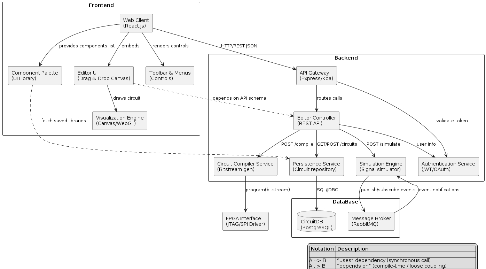
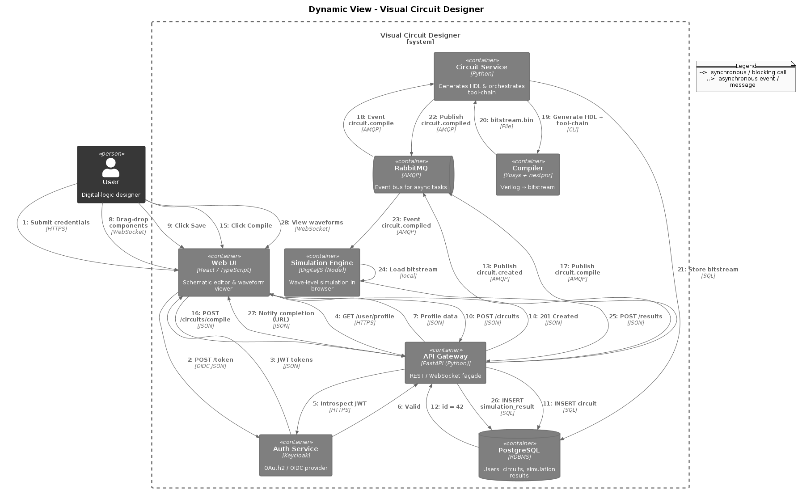
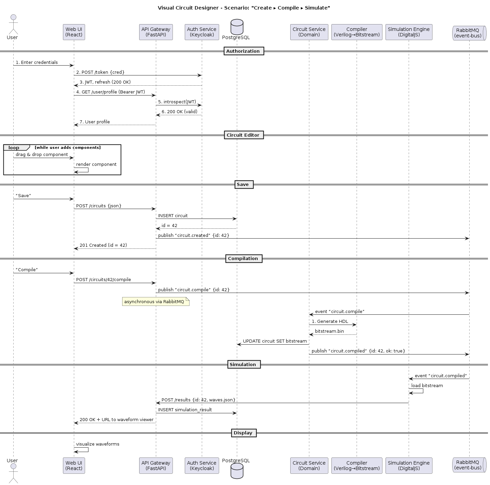

# 
 Architecture 

  The architecture of <strong>Visual Circuit Designer</strong> is structured into three complementary views—static, dynamic, and deployment—to give stakeholders and developers clear, orthogonal perspectives on how the system is built, behaves at runtime, and is hosted in production.

---

## 
 📦 Static View 📦 

  This diagram shows the core modules and their relationships at design time.  
  

In the static view, we separate responsibilities into two main tiers:

<ul>
  <li><strong>Frontend:</strong>  
    <ul>
      <li>Built with <strong>React.js</strong> and <strong>Next.js</strong> for server-side rendering.</li>
      <li><code>Component Palette</code> – Drag-and-drop library of logic gates and I/O blocks.</li>
      <li><code>Editor UI</code> – Interactive schematic canvas with grid snapping and pan/zoom.</li>
      <li><code>Toolbar &amp; Menus</code> – Global actions (save, compile, simulate).</li>
      <li><code>Visualization Engine</code> – WebGL-accelerated renderer for schematics and waveform charts.</li>
    </ul>
  </li>
  <li><strong>Backend:</strong>  
    <ul>
      <li><code>API Gateway</code> (Express/Koa) – Unified entry point for REST and WebSocket traffic.</li>
      <li><code>Editor Controller</code> – Business logic for circuit CRUD operations.</li>
      <li><code>Circuit Compiler Service</code> – Translates schematics into FPGA bitstreams via Yosys + nextpnr.</li>
      <li><code>Persistence Service</code> – Stores circuit definitions in <strong>PostgreSQL</strong>.</li>
      <li><code>Simulation Engine</code> – High-performance digital logic simulator written in Python.</li>
    </ul>
  </li>
</ul>

> 💡 The static view emphasizes **separation of concerns**—UI, business logic, persistence, simulation—and allows each component to be developed and tested independently.

---

## 
 🔄 Dynamic View 🔄 

  The dynamic view a typical user operation from login through simulation.
  

When a user interacts with the editor, a sequence of events unfolds:

<ol>
  <li><strong>Authentication:</strong> Browser retrieves an OIDC token from Keycloak.</li>
  <li><strong>Edit & Save:</strong> User draws or modifies a circuit, then clicks “Save.” The editor issues a POST to <code>/api/circuits</code>.</li>
  <li><strong>Compile Request:</strong> Clicking “Compile” sends a message to RabbitMQ on <code>compile.queue</code>.</li>
  <li><strong>Compilation:</strong> The Circuit Compiler Service dequeues the job, runs Yosys/nextpnr, and produces a bitstream.</li>
  <li><strong>Simulation:</strong> Bitstream is passed to the Simulation Engine, which computes logic waveforms.</li>
  <li><strong>Results:</strong> Simulation results are returned via WebSocket and visualized in the browser.</li>
</ol>

> 🔍 This flow ensures non-blocking UI—compilation and simulation happen asynchronously, letting the user continue editing while jobs run.

---

## 
 📲 Deployment View 📲 

  Shows how services are deployed, networked, and monitored in production.  
  

Our production stack runs entirely in Docker containers, orchestrated by Docker Compose on an Ubuntu 22.04 VM:

<ul>
  <li><code>Nginx</code>: Serves static assets and terminates SSL.</li>
  <li><code>API Gateway</code>: Handles all inbound client traffic.</li>
  <li><code>Keycloak</code>: User authentication &amp; authorization.</li>
  <li><code>PostgreSQL</code>: Durable storage for circuits &amp; user data.</li>
  <li><code>RabbitMQ</code>: Reliable message queue for compile/sim jobs.</li>
  <li><code>Compiler &amp; Simulator</code> containers: Auto-scaled based on load.</li>
  <li><strong>Monitoring:</strong> Promtail → Loki → Grafana for centralized logging and alerting.</li>
</ul>

> 📈 This topology supports horizontal scaling of compiler/simulator workers and provides real-time observability.

---

  <strong style="font-size:2em">🛠️ Tech Stack 🛠️</strong>

  <ul style="display: inline-block; text-align: left; list-style: none; padding: 0; margin: 1em 0;">
    <li style="margin: 0.5em 0;"><strong>Frontend:</strong> React.js, Next.js, Tailwind CSS</li>
    <li style="margin: 0.5em 0;"><strong>API:</strong> Node.js, Express (or Koa), WebSocket</li>
    <li style="margin: 0.5em 0;"><strong>Database:</strong> PostgreSQL</li>
    <li style="margin: 0.5em 0;"><strong>Simulation Engine:</strong> Python (RunningNode service)</li>
    <li style="margin: 0.5em 0;"><strong>Deployment:</strong> Docker Compose on Ubuntu 22.04</li>
    <li style="margin: 0.5em 0;"><strong>Monitoring:</strong> Grafana, Loki, Promtail</li>
  </ul>

