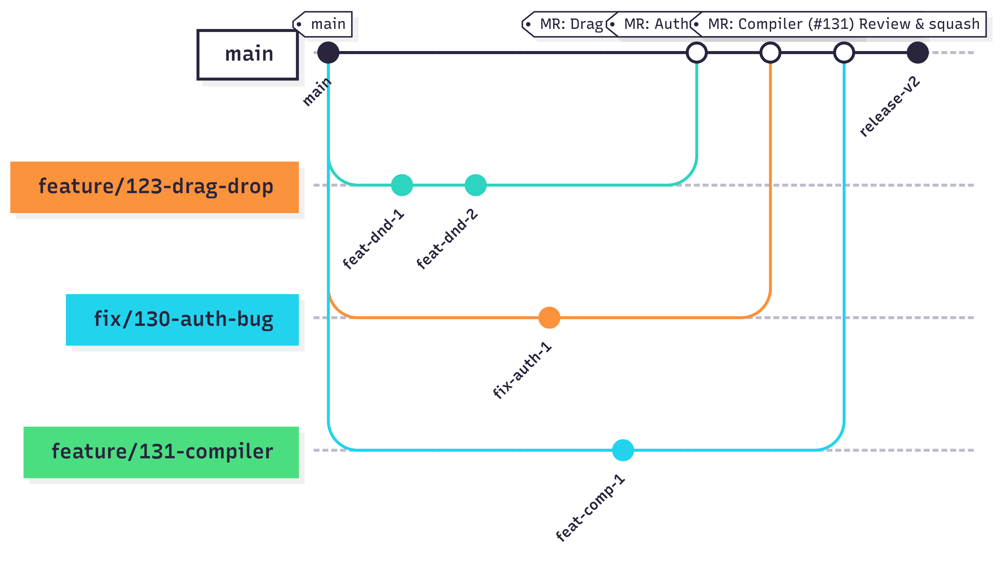

# <div align="center"> 🛠️ Development </div>

---

## <div align="center"> 🗒️ Kanban Board 🗒️ </div>

We use the built-in [GitLab Issue Board](https://gitlab.pg.innopolis.university/team-45/visual-circuit-designer/-/boards) for task management.  
Each column reflects the current status of issues in our workflow:

### Columns and Entry Criteria:

- **To Do**
    - New issues that are ready for implementation.
    - Must have: title, description, proper labels (story points, priority, component, sprint, etc.).
    - Acceptance criteria and test cases are defined.

- **In Process**
    - Issue is actively being worked on by an assignee.
    - The issue was moved here when a developer started implementation and created a feature branch.

- **Sprint N**
    - Issues scheduled and prioritized for the respective sprint.
    - Issue moved here during sprint planning.
    - All requirements and labels are clarified.

- **Closed**
    - Issue is fully completed.
    - All acceptance criteria are met, test cases passed, code merged into `main`, and deployment (if required) is done.

> Our live issue board: [GitLab Issue Board](https://gitlab.pg.innopolis.university/team-45/visual-circuit-designer/-/boards)

---

## <div align="center"> 🔨 Branching Workflow 🔨 </div>

```bash
git pull origin main
git checkout -b feature-name
# make changes
git add .
git commit -m "Short description"
git push origin feature-name
```
- Create a Merge Request into main
- Resolve conflicts if any
- Check "Delete branch after merge"
### Environments
_**dev:**_ for local development

_**prod:**_ auto-deployed via GitLab CI/CD when merged into main

---

## <div align="center"> 💾 Git Workflow 💾 </div>

We follow an adapted **GitHub Flow** model using GitLab features. The workflow ensures structured development and traceability.

### <div align="center"> 🔖 Labels 🔖 </div>

We use labels to classify, prioritize, and track issues effectively:

- **Story points**:
    - `1 sp`, `2 sp`, `3 sp`, `4 sp`, `5 sp` – indicate task complexity.

- **Component**:
    - `Front-end` – UI-related tasks
    - `Back-end` – server logic and APIs

- **Priority**:
    - `HIGH priority` – critical to current sprint
    - `LOW priority` – can be deferred

- **Status**:
    - `In Progress` / `In Process` – work started
    - `Completed` – work finished and merged
    - `Partially implemented` – only some acceptance criteria fulfilled

- **Planning**:
    - `Acceptance Criteria` – issue includes user acceptance criteria
    - `Deep BackLog` – not planned for current/next sprint
    - `Needs-discussion` – requires clarification

- **Sprints**:
    - `Sprint 1`, `Sprint 2`, `Sprint 3`, `Sprint 4`, `Sprint 5`, `Sprint 6` – group issues by sprint

> Each issue must include:
> - A story point label (`X sp`)
> - Component label (`Front-end` or `Back-end`)
> - Priority (`HIGH` or `LOW`)
> - Sprint assignment
> - `Acceptance Criteria` if applicable
> - `User story` if applicable
> - `Test case` if applicable

### <div align="center"> 🚀 Pull Requests 🚀 </div>

- All features/bugs must be merged via a Merge Request (MR)
- MR must:
    - Reference an issue: `Closes #123`
    - Be reviewed by at least 1 team member
    - Pass all CI pipelines
- Squash merge is mandatory
- Branch is deleted after merge

### <div align="center"> ✅ Issue Lifecycle ✅ </div>

1. Create an issue
2. Add all relevant labels
3. Assign the issue to a team member
4. Create a branch and link the issue
5. Open a Merge Request (MR)
6. Submit for code review
7. Merge after approval
8. Issue is automatically closed when MR is merged

### <div align="center"> 🧭 Gitgraph Diagram 🧭 </div>

The diagram below illustrates our development flow using branches for features and fixes, each merged into `main` via Merge Requests (MR):



#### Legend

- **main** — the main integration branch
- **feature/xxx** — feature implementation branches
- **fix/xxx** — bugfix branches
- **MR** — Merge Request into `main`
- **Review & squash** — squashed commits during merge for a cleaner history
- **release-v2** — a versioned release branch created after merging key features

#### Example Branch Flow

| Branch                 | Purpose                              | Status   |
|------------------------|--------------------------------------|----------|
| `feature/123-drag-drop`| Drag-and-drop UI implementation      | Merged   |
| `fix/130-auth-bug`     | Fix login/authentication issue       | Merged   |
| `feature/131-compiler` | Compiler and simulation integration  | Merged   |
| `release-v2`           | Stable release branch                | Released |

---

## <div align="center"> 💻 Local Development 💻 </div>

Use the provided `Makefile` for ease of setup:

| Command         | Description                                 |
|-----------------|---------------------------------------------|
| `make dev-up`   | Launches frontend/backend with DB           |
| `make dev-down` | Stops and removes all containers            |
| `make dev-logs` | Displays logs for all running containers    |
| `make prune`    | Cleans up unused Docker resources           |

- Uses `docker-compose.dev.yml`
- Runs on port **3001**
- **Grafana / Loki / Promtail are disabled** in dev environment

---

## <div align="center"> 📁 Secrets Management 📁 </div>

All secrets (API keys, DB passwords, etc.) are stored in `.env` files, which are **never committed** to version control. In CI, secrets are managed via GitLab CI/CD variables. For deployment, secrets are injected as environment variables via Docker Compose.

---

## <div align="center"> 👥 Team Members and Contributions 👥 </div>

This section details the roles and contributions of team members as of 11:59 AM CEST on Saturday, July 19, 2025, based on activities completed across multiple sprints.

- **Iskander Kutlakhmetov (Runner Node)**
  - Managed and optimized the runner node infrastructure to ensure reliable execution of automated processes across all sprints.
  - Monitored system performance and resolved runtime issues, particularly supporting CI/CD deployment for MVP2 (Sprint 4).
  - Coordinated with backend and frontend teams to align node operations with project development timelines, including centralized logging setup (Task #20, Sprint 4).

- **Nikita Khripunkov (Back-end Developer)**
  - Designed and enhanced backend APIs for user authentication (Task #12, Sprint 2) and circuit saving/loading (Task #22, Sprint 4).
  - Implemented database schema deletion (Task #33, Sprint 6) and provided backend support for bug fixes (Task #31, Sprint 5).
  - Contributed to the simulation engine integration (Task #6, Sprint 6) and configured local development environment (Task #20, Sprint 4).

- **Amir Gabdullin (Back-end Developer)**
  - Led the backend integration for the playground simulation (Task #34, Sprint 6) and database schema management.
  - Resolved critical backend bugs, including logical-circuit simulation issues (Task #29, Sprint 5).
  - Supported the development of the API service for saving and loading circuits (Task #22, Sprint 4) and persistent project lists (Task #28, Sprint 5).

- **Islam Gainullin (Front-end Developer)**
  - Directed the implementation of the drag-and-drop interface (Task #1, Sprint 1) and welcome page redesign (Task #37, Sprint 6).
  - Developed the authorization screen UI (Task #14, Sprint 1) and popup interactive window (Task #13, Sprint 2).
  - Enhanced front-end functionality with component connection features (Task #2, Sprint 1) and playground page fixes (Task #16, Sprint 3).

- **Ernest Kudakaev (Front-end Developer)**
  - Implemented the basic UI framework (Task #13, Sprint 1) and playground bug fixes (Task #35, Sprint 6).
  - Contributed to the drag-and-drop interface for logic design (Task #1, Sprint 1) and visual validation of schemas (Task #15, Sprint 6, in process).
  - Supported the development of the browser-based circuit simulation (Task #6, Sprint 6) and dashboard view toggle (Task #27, Sprint 5).

## Additional Notes
- All team members actively participated in peer code reviews and deployment procedures to maintain elevated quality standards.
- Cross-functional support was provided to address interdisciplinary challenges, particularly during MVP2 development (Sprint 4 and 5).
- This document will be updated at the conclusion of each sprint to reflect ongoing contributions and ensure an accurate record.